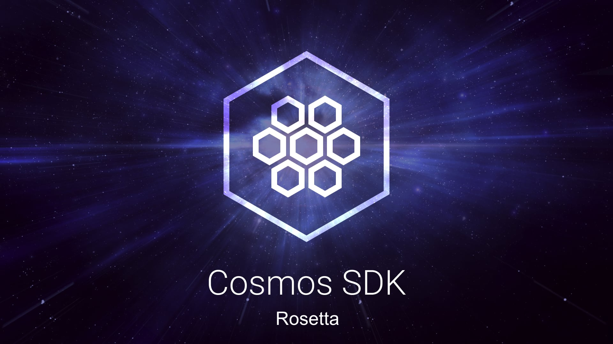

<div align="center">
  <h1> Cosmos - Rosetta </h1>
</div>



The `rosetta` project implements Coinbase's [Rosetta API](https://www.rosetta-api.org). This document provides instructions on how to use the Rosetta API integration. For information about the motivation and design choices, refer to [ADR 035](https://docs.cosmos.network/main/architecture/adr-035-rosetta-api-support).

## Installing Rosetta

The Rosetta API server is a stand-alone server that connects to a node of a chain developed with Cosmos SDK.

Rosetta can be added to any cosmos chain node. standalone or natively.

### Standalone 

Rosetta can be executed as a standalone service, it connects to the node endpoints and expose the required endpoints.

Install Rosetta standalone server with the following command:

```bash
go install github.com/cosmos/rosetta
```

Alternatively, for building from source, simply run `make rosetta`. The binary will be located in the root folder.

### Native - As a node command

To enable Native Rosetta API support, it's required to add the `RosettaCommand` to your application's root command file (e.g. `simd/cmd/root.go`).

Import the `rosettaCmd` package:

```go
import "github.com/cosmos/rosetta/cmd"
```

Find the following line:

```go
initRootCmd(rootCmd, encodingConfig)
```

After that line, add the following:

```go
rootCmd.AddCommand(
  rosettaCmd.RosettaCommand(encodingConfig.InterfaceRegistry, encodingConfig.Codec)
)
```

The `RosettaCommand` function builds the `rosetta` root command and is defined in the `rosettaCmd` package (`github.com/cosmos/rosetta/cmd`).

Since we’ve updated the Cosmos SDK to work with the Rosetta API, updating the application's root command file is all you need to do.

An implementation example can be found in `simapp` package.

## Use Rosetta Command

To run Rosetta in your application CLI, use the following command:

> **Note:** if using the native approach, add your node name before any rosetta comand.

```shell
rosetta --help
```

To test and run Rosetta API endpoints for applications that are running and exposed, use the following command:

```shell
rosetta
     --blockchain "your application name (ex: gaia)"
     --network "your chain identifier (ex: testnet-1)"
     --tendermint "tendermint endpoint (ex: localhost:26657)"
     --grpc "gRPC endpoint (ex: localhost:9090)"
     --addr "rosetta binding address (ex: :8080)"
     --grpc-types-server (optional) "gRPC endpoint for message descriptor types"
```

## Plugins - Multi chain connections

Rosetta will try to reflect the node types trough reflection over the node gRPC endpoints, there may be cases were this approach is not enough. It is possible to extend or implement the required types easily trough plugins.

To use Rosetta over any chain, it is required to set up prefixes and registering zone specific interfaces through plugins.

Each plugin is a minimalist implementation of `InitZone` and `RegisterInterfaces` which allow Rosetta to parse chain specific data. There is an example for cosmos-hub chain under `plugins/cosmos-hun/` folder
- **InitZone**: An empty method that is executed first and defines prefixes, parameters and other settings.
- **RegisterInterfaces**: This method receives an interface registry which is were the zone specific types and interfaces will be loaded

In order to add a new plugin: 
1. Create a folder over `plugins` folder with the name of the desired zone
2. Add a `main.go` file with the mentioned methods above.
3. Build the code binary through `go build -buildmode=plugin -o main.so main.go` 

The plugin folder is selected through the cli `--plugin` flag and loaded into the Rosetta server.

## Extensions

There are two ways in which you can customize and extend the implementation with your custom settings.

### Message extension

In order to make an `sdk.Msg` understandable by rosetta the only thing which is required is adding the methods to your messages that satisfy the `rosetta.Msg` interface. Examples on how to do so can be found in the staking types such as `MsgDelegate`, or in bank types such as `MsgSend`.

### Client interface override

In case more customization is required, it's possible to embed the Client type and override the methods which require customizations.

Example:

```go
package custom_client
import (

"context"
"github.com/coinbase/rosetta-sdk-go/types"
"github.com/cosmos/rosetta/lib"
)

// CustomClient embeds the standard cosmos client
// which means that it implements the cosmos-rosetta-gateway Client
// interface while at the same time allowing to customize certain methods
type CustomClient struct {
    *rosetta.Client
}

func (c *CustomClient) ConstructionPayload(_ context.Context, request *types.ConstructionPayloadsRequest) (resp *types.ConstructionPayloadsResponse, err error) {
    // provide custom signature bytes
    panic("implement me")
}
```

NOTE: when using a customized client, the command cannot be used as the constructors required **may** differ, so it's required to create a new one. We intend to provide a way to init a customized client without writing extra code in the future.

### Error extension

Since rosetta requires to provide 'returned' errors to network options. In order to declare a new rosetta error, we use the `errors` package in cosmos-rosetta-gateway.

Example:

```go
package custom_errors
import crgerrs "github.com/cosmos/rosetta/lib/errors"

var customErrRetriable = true
var CustomError = crgerrs.RegisterError(100, "custom message", customErrRetriable, "description")
```

Note: errors must be registered before cosmos-rosetta-gateway's `Server`.`Start` method is called. Otherwise the registration will be ignored. Errors with same code will be ignored too.
